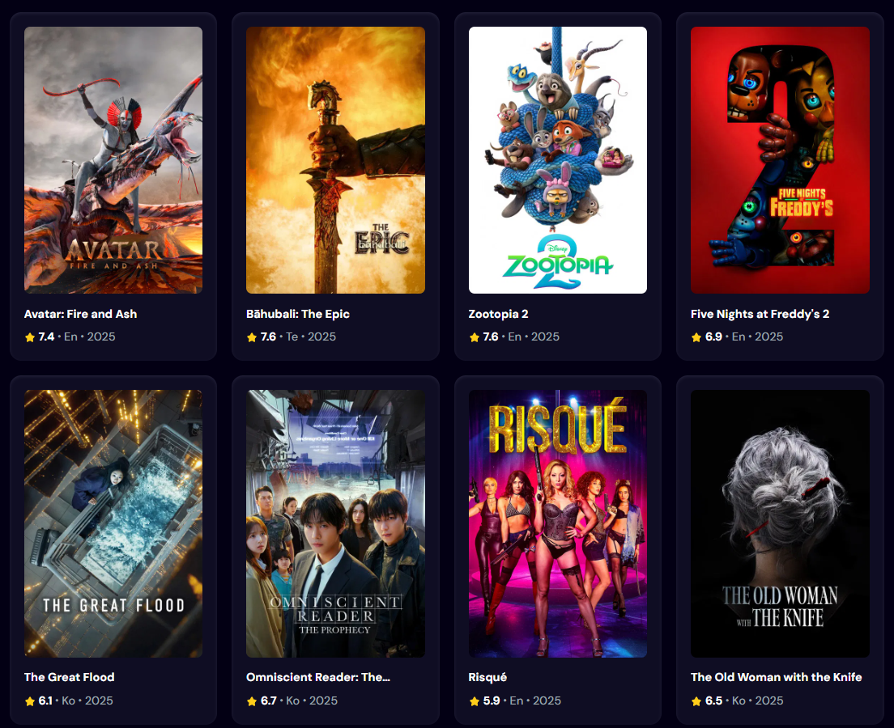

  
   
  

    
    
  

  <h3 align="center">A Movie App</h3>

   

     MovieReactApp is a modern, responsive movie search web application built with React 19, Vite, and Tailwind CSS. The app provides a clean UI for browsing and searching movies.
    

## ✨ Features

- 🔍 Movie search by title  
- 📱 Responsive UI with Tailwind CSS  
- 🖼️ Fallback image for missing posters  
- ⚡ Fast build with Vite  
- 👉 Responsiveness

## 🧰 Tech Stack

- ⚛️ React  
- ⚡ Vite  
- 🎨 Tailwind CSS  
- 🛠️ ESLint  
- 🚀 GitHub Pages

## 🔗 Demo

- 🌍 [Movie App Demo](https://n1ckdevops.github.io/movieReactApp/)

## 🖼️ Screenshots

## 👤 Author

Nickolas  
Frontend Developer  
GitHub: [@n1ckdevops](https://github.com/n1ckdevops)
